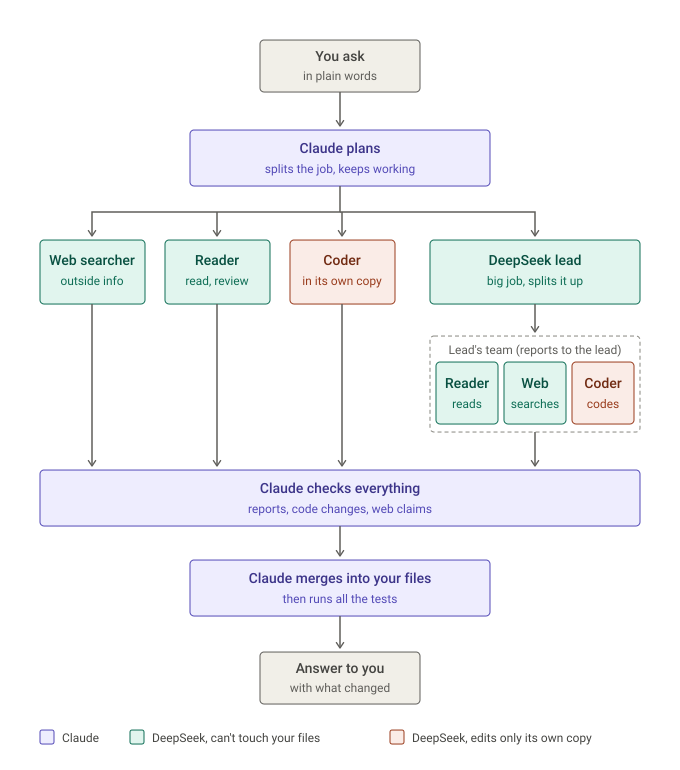

# DeepSeek agents for Claude Code

## Install

### What you need first

- A **Windows** computer.
- The **Claude desktop app** ([download](https://claude.ai/download)) with a plan that includes Claude
  Code, or the Claude Code command-line tool.
- A **DeepSeek account** with a little credit. Sign up at [platform.deepseek.com](https://platform.deepseek.com),
  add credit under **Top up**, and create a key under **API keys**. Keep that key handy: you'll paste it
  once during setup.
- **Python 3.** If you don't have it, setup tells you how to get it.

### The easy way: paste this into Claude

Open the Claude desktop app, go to the **Code** tab, start a session, and paste this in:

```text
Please install "DeepSeek agents for Claude Code" for me.

1. Download https://github.com/BimingtonBill/deepseek-agents-for-claude-code/releases/latest/download/deepseek-agents-for-claude-code.zip into a new folder called "deepseek-agents-setup" in my Downloads folder, and unzip it there.
2. Read setup.ps1 in the unzipped folder so you know what it does, then run it:
   powershell -NoProfile -ExecutionPolicy Bypass -File setup.ps1
   It installs the skills and checks for Python and Claude Code. If I haven't saved a DeepSeek API key yet, it opens a separate window where I type the key myself.
3. Tell me in plain words what it reported and what I need to do next.

Never ask me to type or paste my DeepSeek API key into this chat.
```

Claude will ask your permission before it downloads and runs things; say yes. If a window pops up
asking for your **DeepSeek API key**, paste the key there (nothing shows as you paste; that's normal)
and press Enter. It checks the key with DeepSeek and shows your balance.

When it's done, **close and reopen the Claude app.**

> **Why a separate window for the key?** Your key is like a password for your DeepSeek account. Anything
> typed into a Claude chat is saved in the chat. The separate window keeps the key out of it, and stores
> it privately on your computer.

### Or install it by hand

1. Download `deepseek-agents-for-claude-code.zip` from the
   [latest release](https://github.com/BimingtonBill/deepseek-agents-for-claude-code/releases/latest) and unzip it.
2. Double-click **`install.cmd`** in the unzipped folder. It installs everything and, if needed, opens the
   window for your DeepSeek key.
3. Close and reopen the Claude app.

## What is this?

An add-on for [Claude Code](https://claude.com/claude-code) that gives Claude a team of cheap helpers.
Claude stays in charge: it splits a job into pieces and hands some of them to DeepSeek AI "workers" that
run in the background on your computer (reading code, researching, drafting code, checking each other's
work). It keeps working on its own part meanwhile, and checks every worker's result before using it.

You'll see the workers in Claude's **Background tasks** panel, with names like
`DeepSeek research #004: find where the game loads save files`.

**Cost:** DeepSeek charges per use. A typical worker task costs a few cents and a big one up to about
20 cents, so a $5 top-up goes a long way. Because the heavy reading and drafting happens on DeepSeek,
your Claude plan (which you still need) lasts longer.

*An independent community project, not made or endorsed by Anthropic or DeepSeek.*

## How it works



Claude splits the job and hands pieces to four kinds of DeepSeek worker:

- **Web searchers** look things up online.
- **Readers** read, research, review and analyse.
- **Coders** write code, each in its own copy of your project.
- **Leads** take a big job and run a small team of their own.

Everything comes back to Claude, which checks it, is the only one that changes your files, and then
answers you. For an interactive version with a slider for the delegation dial, download
[`docs/flowchart.html`](docs/flowchart.html) and open it in your browser.

## Using it

Just ask Claude in plain words, in any project:

- *"Use DeepSeek workers to find every place this project reads its settings file, and summarise them."*
- *"Have DeepSeek research how other mods handle save files while you work on the menu."*
- *"Get a DeepSeek worker to review the change you just made."*
- *"Have a DeepSeek web searcher find the latest version of this library and what changed."*

Or type `/deepseek-agents` to switch it on for the session.

## How much should Claude hand off? The delegation dial

A setting from **1 to 5** tells Claude how much work to give DeepSeek. Higher means Claude hands off more
and uses less of your Claude limits, but more of the work is first done by DeepSeek, which is cheaper and
less reliable, so Claude spends its time checking instead.

| Level | Name | What Claude does |
|:---:|---|---|
| **1** | Only when asked | Does everything itself, and uses DeepSeek only when you ask it to. |
| **2** | Research and checking | Hands off research, reading through lots of files, and reviews. Writes all code itself. |
| **3** | **Balanced (the default)** | As 2, and also hands off small, self-contained pieces of code (a new tool, a test file), several at once. |
| **4** | **Claude manages** | Claude plans, writes the instructions, checks and fits the pieces together. DeepSeek does most of the exploring and coding. *A good choice for bigger projects.* |
| **5** | Everything | Claude only manages: every task, however small, goes to DeepSeek unless it needs you or this conversation. |

How often each worker is used, roughly:

| Level | Web searcher | Reader | Coder | Lead |
|:---:|---|---|---|---|
| 1 | only if you ask | only if you ask | only if you ask | only if you ask |
| 2 | likely | likely | never | rare |
| 3 | likely | very likely | sometimes | rare |
| 4 | very likely | very likely | very likely | for big jobs |
| 5 | almost always | almost always | almost always | often |

**What never changes, at any level:** Claude talks to you, makes the design decisions, puts the pieces
together, handles anything security-sensitive, and **checks every piece of DeepSeek work before using it**.

**How to change it:** just tell Claude, for example:

- *"Set the DeepSeek delegation level to 4 for this project."*
- *"Make DeepSeek delegation 2 my default for all projects."*

Or type **`/delegation`** in Claude: on its own it shows the level, `/delegation 4` sets it for this project, `/delegation 2 global` sets your default, and `/delegation table` lists the levels.

## Keeping costs down: spend limits

You can give DeepSeek a budget, per day or per week, covering all your projects. It works like Claude's usage limits: before each worker starts, the kit checks what you've spent and what that kind of worker usually costs. If it won't fit, the worker doesn't start and Claude does the work itself. A worker that's running when you hit the limit is stopped, and whatever it had found is kept. The limit resets at midnight, or on Monday for a weekly one (or, if you ask for it to count from now, on the weekday you set it).

It also paces the spending so you rarely hit the limit at all, a bit like cruise control. The budget is spread evenly over the day (or week), with a head start so the morning isn't held back. If spending gets ahead of that pace, workers ease off step by step: less thinking effort, then one worker at a time, then no big coding jobs until the pace catches up. Claude also hands off a little less while it's ahead of pace. It also checks your DeepSeek balance, so workers don't start when your credit can't cover them, and Claude can see how long your credit will last and tells you when it's time to top up.

You can also cap what any one worker may cost ("stop any worker at $1.50"): it's told to wrap up as it gets close, and stopped at the cap with what it had found kept. Only about 1 in 20 workers has ever cost that much.

There's no limit until you set one. Just tell Claude, for example:

- *"Limit DeepSeek to $2 a day."*
- *"How much DeepSeek have I used today?"*
- *"Make my DeepSeek credit last two weeks."* Each day then gets an even share of what's left, worked out again every morning, so if one day is quiet the next ones get a little more.

Or type **`/spend-limit`** in Claude: on its own it shows what's spent, what's left and the pace (DeepSeek's and your Claude plan's); `/spend-limit 20 week`, `/spend-limit 2 day` or `/spend-limit 1.5 run` set a limit (add `from now` to count only from now on), and `/spend-limit last 2 weeks` makes your credit last that long, and `/spend-limit off` removes them.

The spend figures are estimates, worked out from token counts at DeepSeek's list prices, so the DeepSeek dashboard is the real bill.

**Claude's own limits are paced too.** Your Claude plan has a 5-hour limit and a weekly one, and Claude's own work and its helpers use them up. In the Claude desktop app, Claude checks its usage at the start of a session, before big batches of work and about hourly in long runs, and works to match: normally at full speed; ahead of pace it hands more to DeepSeek and uses fewer of its own helpers; near a limit it only coordinates the DeepSeek workers. The two budgets cover for each other: while Claude is short, DeepSeek is allowed to spend faster (never past your limit), and when both are short, work waits for a reset rather than using either one up. Claude also suggests compacting (`/compact`) at a quiet moment when a long session has grown big, since every message re-reads the whole conversation.

## It learns and adjusts as it goes

- **A map of your project for every worker.** A cheap worker writes a short guide to where things are in your project, and every worker gets it with its task, so it doesn't spend steps (and money) exploring first. It's refreshed when the code has moved on.
- **Lessons from reviews.** Mistakes that reviews catch are collected into a short "pitfalls" list that every coder reads before starting, so the same mistakes stop coming back.
- **A tap on the shoulder.** If a worker starts to drift (running long, reading too much, retrying something that's not allowed, or sleeping on a build), it's told so straight away and asked to wrap up.
- **Standing audits.** Each important part of your project can get a checklist of what must stay true there, and a review worker re-checks only the parts whose code changed. Problems it confirms are kept as numbered items until they're fixed.
- **A morning report.** When you open Claude after workers ran unattended, Claude gets a short summary of what happened and what needs attention.

## Is it safe?

- **Workers only see the project you point them at.** They can't see your Claude account, your chats or
  other folders.
- **Your DeepSeek key stays on your computer**, saved for your Windows account only.
- **Workers can't change files they weren't given.** Coding tasks happen in a separate copy of your
  project, and Claude reviews the changes before bringing them in.
- **Anything from the web is treated as unverified.** Web searchers can't see your project at all, and
  a worker that has read the web can only change a separate copy, which Claude checks first.
- **It adds a hook to Claude Code** (in `~/.claude/settings.json`, backed up first). It:
  - makes sure every DeepSeek worker, and each of Claude's own helpers, shows up in the Background tasks panel
    under a clear name (it asks Claude to retry a launch that isn't named that way);
  - records Claude's helpers beside the workers;
  - runs Claude's coding helpers on its strongest model unless your Claude plan is running low;
  - adds short notes for Claude about the budgets, its own pace, and when the project map needs a refresh.

  It doesn't change anything else Claude does. To install without it, run
  `powershell -ExecutionPolicy Bypass -File tools/install-skill.ps1 -NoHooks` from the unzipped folder. To
  remove it later, delete the entries that mention `ds_hook.py` from that file.
- **If a job needs a program you don't have**, Claude stops and asks you to install it rather than
  working around it.

## If something goes wrong

| You see | What to do |
|---|---|
| `DEEPSEEK_API_KEY is not set` | Run `install.cmd` from the unzipped folder again; it reopens the key window. |
| `DeepSeek rejected DEEPSEEK_API_KEY (401)` | The key is wrong or was deleted. Create a new one at platform.deepseek.com and run `install.cmd` again. |
| `balance is too low` / `402` | Add credit at [platform.deepseek.com/top_up](https://platform.deepseek.com/top_up). |
| `Claude Code was not found` | Install the Claude desktop app and open its Code tab once. |
| `it needs Python` | Install Python: `winget install Python.Python.3.12`, then restart Claude. |
| A worker seems stuck | Ask Claude: *"Show me the running DeepSeek workers and stop the stuck one."* |

## For the technically curious

- `skill/`: the two Claude Code skills (`deepseek-agents`, `advisor-loop`) that teach Claude how to lead workers.
- `launcher/`: `ds-agent.ps1` starts one worker as a headless Claude Code process pointed at DeepSeek's
  Anthropic-compatible API, with its own permissions, a 128k output cap and a run record.
- `tools/`: coding tasks in isolated git worktrees (`ds_impl.ps1`), run status, the run manifest, the
  delegation dial, result and citation checkers.
- `docs/design/`: how naming, crosstalk between workers, DeepSeek leads, effort levels and the
  delegation dial work, with the test evidence behind each.

## License

MIT. See [`LICENSE`](LICENSE).
